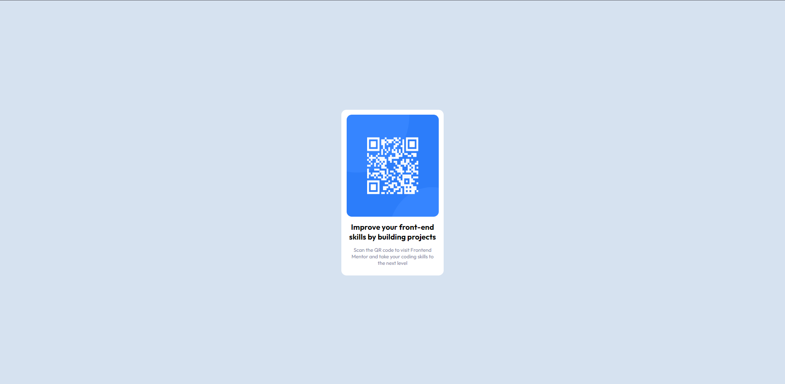
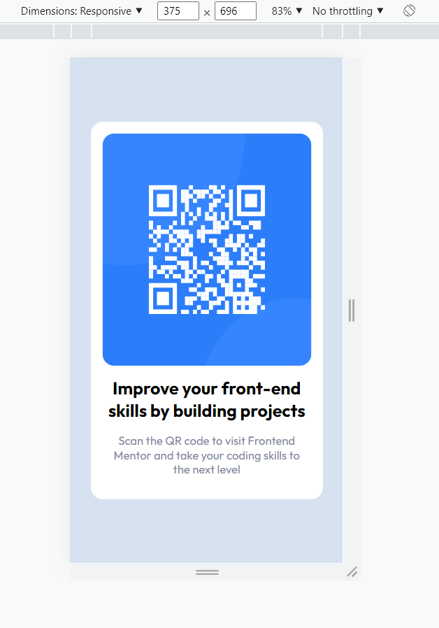

# Frontend Mentor - QR code component solution

This is a solution to the [QR code component challenge on Frontend Mentor](https://www.frontendmentor.io/challenges/qr-code-component-iux_sIO_H). Frontend Mentor challenges help you improve your coding skills by building realistic projects. 

## Table of contents

- [Overview](#overview)
  - [Screenshot](#screenshot)
  - [Links](#links)
- [My process](#my-process)
  - [Built with](#built-with)
  - [What I learned](#what-i-learned)
- [Author](#author)

 -Desktop view
 

 -Mobile view
 


### Links

- Solution URL: [URL...](https://rjcabalda.github.io/qr-code-component-main/index.html)
- Live Site URL: [URL...](https://rjcabalda.github.io/qr-code-component-main/index.html)

## My process
-set up the mark up.
-styling the with and height of the container.
-aligning the child element in the container by using flexbox.
-setting color, font weight and font sizes.

### Built with

- Semantic HTML5 markup
- CSS custom properties
- Flexbox
- desktop-first workflow

### What I learned

  Building a projects make me grow my web development skills. Practicing best practice in coding and using flexbox is very useful and handy for the design of this project.

To see how you can add code snippets, see below:

```html
      <div class="container">
          <div class="container__box">
            
            <h1 class="heading-primary">Improve your front-end skills by building projects</h1>
            <p class="paragraph"> Scan the QR code to visit Frontend Mentor and take your coding skills to the next level</p>
          </div>

      </div>
```
```css
.container{
    max-width: 100%;
    height: 100vh;
    display: flex;
    justify-content: center;
    align-items: center;
}

.container__box > * {
    margin: 1rem auto 0 auto;
    text-align: center;
}
```
```js

```

## Author

- Website - [Rio Cabalda](https://rjcabalda.github.io/qr-code-component-main/index.html)
- Frontend Mentor - [@rjcabalda](https://www.frontendmentor.io/profile/rjcabalda)


